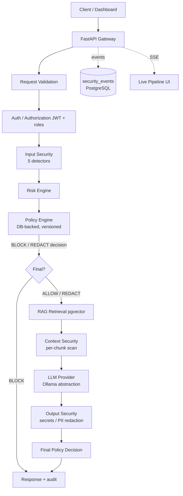

# Architecture

## System overview



## Request lifecycle stages

Each stage emits `make_event(...)` payloads (spec §29) to both the database
(`security_events`) and the in-process SSE bus:

REQUEST_RECEIVED → INPUT_SECURITY_{STARTED,COMPLETED} → RISK_CALCULATED →
POLICY_EVALUATED → RETRIEVAL_{STARTED,COMPLETED} →
CONTEXT_SECURITY_{STARTED,COMPLETED} → LLM_{STARTED,COMPLETED} →
OUTPUT_SECURITY_{STARTED,COMPLETED} → FINAL_DECISION → RESPONSE_SENT.

Failures emit `STAGE_FAILED` with the failing stage name.

## Module layout

```
backend/app/
  api/routes/       HTTP layer (auth, chat, documents, policies, observability)
  core/             config, errors, logging, redaction, middleware, rate limit,
                    request context, crypto
  security/         patterns + detector framework + detectors/ + pipeline
  risk/             risk aggregation engine
  policy/           policy evaluation engine (Pydantic-validated configs)
  rag/              text extraction, chunking, embeddings, vector search,
                    context security
  llm/              provider abstraction (OllamaProvider), factory
  database/         engine/session, ORM models (14 tables)
  services/         chat pipeline orchestration, document ingestion, policies
  observability/    stage enums, event bus (SSE)
```

Frontend: `frontend/src/{pages,components,hooks,services}` — pages map 1:1 to
dashboard features; `services/api.ts` is the single HTTP client with the error
envelope handling.

## Key design decisions

1. **Detectors as replaceable components** (`SecurityDetector` interface with
   `name`, `version`, `analyze`, `health_check`) — every stored event records
   the detector version so behavior changes are evaluable over time.
2. **Policy engine is the single decision authority** — detectors produce
   signals; policy maps signals to actions. No action logic is scattered in
   pipeline code.
3. **Risk aggregation is documented, not naive** — see
   [security-model.md](security-model.md#risk-aggregation).
4. **Fail-closed for security stages, fail-open for observability** — the full
   matrix is in [security-model.md](security-model.md#fail-open-vs-fail-closed).
5. **Provider abstraction** — Ollama is the only concrete provider; the factory
   raises a clear configuration error for unconfigured vendors.
6. **Buffered LLM output** (spec §53) — streaming is implemented at provider
   level but the gateway buffers and scans before returning. Chunk-level
   scanning is a documented future improvement.
